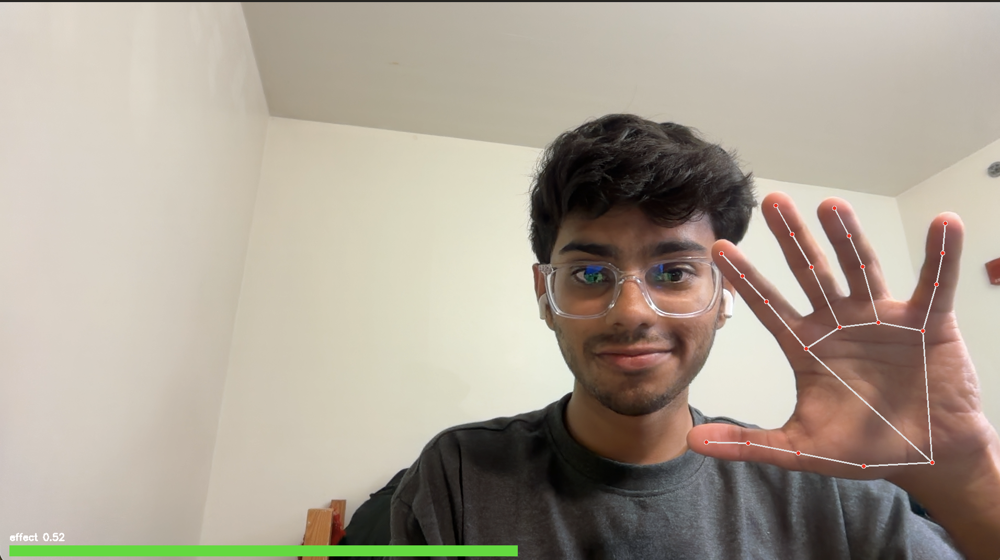
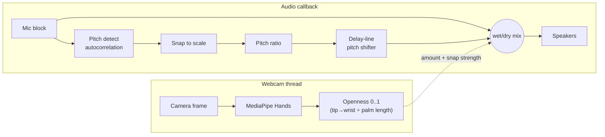

# gesture-autotune

**Control a real-time autotune effect with your hands.** Open your hand and your
voice snaps to a musical scale; close it and you're dry again. The pitch
correction is written from scratch in NumPy — no Auto-Tune, no Harmony Engine, no
VST, no DAW.



---

## Why this exists

A viral clip showed someone "controlling a vocoder with their hands" using
MediaPipe for tracking and a paid Harmony Engine VST for the audio. That setup
does no audio engineering — the plugin does all the interesting work. This project
rebuilds the whole thing as code: **hand tracking → musical pitch correction →
live audio**, with the DSP implemented and unit-tested by hand. It's small,
self-contained, and runs on a laptop webcam + mic for $0.

## What it does

- Tracks one hand on the webcam and computes a scale-invariant **"openness"** value.
- Detects the **fundamental pitch** of your voice in real time.
- Snaps that pitch to the nearest note in a chosen **key/scale** (e.g. C major, A minor).
- Mixes the corrected voice against the dry voice, with the **amount and snap
  strength driven by how open your hand is**.

Everything runs in two decoupled loops so the camera never stalls the audio.

## How it works



**Gesture mapping.** `amount = openness` (wet/dry), and
`correction_strength = 0.3 + 0.7 · openness` (the snap gets harder as you open
up). Closed fist → your natural voice; open hand → full robotic snap-to-scale.

## Tests

Install the dev dependencies, then run the suite (pure NumPy, no audio hardware needed):

```
pip install -e ".[dev]"
pytest -q
#21 passed
```

The tests confirm pitch detection recovers pure tones to <1%, the shifter scales
frequency by the requested ratio (0.5×–2×), unity is energy-preserving, and the
end-to-end autotune pulls a detuned note toward the scale. The offline demo makes
that measurable: a synthetic vocal that is **57 cents out of tune** comes out at
**10 cents** after correction.

```
$ python scripts/demo_offline.py        # writes dry.wav, tuned.wav, sweep.wav
dry   median pitch error: 57.0 cents
tuned median pitch error: 10.2 cents
```

`sweep.wav` ramps the gesture amount 0 → 1 over the clip, so you can hear the
effect fade in exactly like opening a hand — no webcam required.

## Requirements

- **Python 3.9–3.12.** MediaPipe does **not** yet publish a build for Python 3.13,
  so the live app needs 3.12 or earlier. The DSP, tests, and offline demo run on
  any of these (including 3.13, since they don't need MediaPipe).
- A **webcam** and **microphone**.
- **Headphones** strongly recommended for the live app (see Troubleshooting →
  feedback). Tested on macOS (CoreAudio); Windows/Linux should work via the same
  `sounddevice` backend but are untested.

## Run it

```bash
git clone https://github.com/ShazifAhmed/gesture-autotune
cd gesture-autotune

# create the environment with a MediaPipe-compatible Python (3.12 here):
python3.12 -m venv .venv
source .venv/bin/activate
pip install -r requirements.txt
pip install -e .                  # installs the package + the `gesture-autotune` command

# hear it offline first (no mic/camera needed):
python scripts/demo_offline.py && open demo_out/sweep.wav

# go live (USE HEADPHONES):
gesture-autotune --key C --mode major
```

**Pick your audio devices** so macOS doesn't route the mic through Bluetooth
(which sounds muffled). Use the **built-in mic** for input and your headphones for
output:

```bash
gesture-autotune --list-devices
**Tip:** prefer device *names* over numbers. Indices reshuffle whenever a device
connects (e.g. an iPhone Continuity Camera, AirPods, or a monitor), so a number
that worked yesterday may point somewhere else today. Names are matched as a
substring and stay stable:

    gesture-autotune --key C --mode major \
      --input-device "MacBook Air Microphone" --output-device "AirPods"
```

These flags apply to that run only — they don't change any system setting.

Open your hand to dial the autotune in, close it to go dry, press `q` to quit.
Scales: `major`, `minor`, `chromatic`, `pentatonic_major`, `pentatonic_minor`.
If the effect feels stuck on/off, calibrate with `--closed-ratio` / `--open-ratio`.

## Troubleshooting

**`No matching distribution found for mediapipe` when installing.**
You're on Python 3.13 (or newer). MediaPipe has no build for it yet. Install
Python 3.12 (`brew install python@3.12`) and recreate the venv with
`python3.12 -m venv .venv`. To just run the tests/offline demo without the live
app, you can stay on 3.13 and `pip install numpy scipy pytest`.

**`PortAudioError: Invalid number of channels [-9998]`.**
The audio device index you passed points at a device that can't do the requested
mono stream — almost always because the device list got renumbered when something
connected (an iPhone Continuity Camera, a headset, an external display). Re-run
`gesture-autotune --list-devices` to get current indices, or just use device
*names* instead of numbers (see "Run it"), which don't shift.

**`No module named 'gesture_autotune'` when running the app.**
The package lives in `src/` and needs to be installed into the venv:
`pip install -e .`. (Tests work without this because pytest adds `src/` to the path.)

**Camera doesn't open — `not authorized to capture video` /
`can not spin main run loop from other thread`.**
macOS only shows the camera-permission dialog from an app's **main thread**, but
capture runs on a background thread. The app handles this by opening the camera
once on the main thread at startup to trigger the prompt — click **Allow**, then
run the command again. If no prompt appears, the terminal was previously denied:
**System Settings → Privacy & Security → Camera**, enable your terminal app (and
the same under **Microphone**), then quit and reopen the terminal. To force a fresh
prompt: `tccutil reset Camera && tccutil reset Microphone`.

**A constant high-pitched tone, even with your hand closed or out of frame.**
That's acoustic feedback: the speakers leak into the mic and the autotune snaps
the howl to a fixed note. **Wear headphones** — it breaks the loop and the tone
stops. Don't use a Bluetooth headset as the *microphone* (macOS drops it to a
low-quality call mode); use the built-in mic for input and headphones for output.

**The effect lags behind my voice.**
Bluetooth audio (e.g. AirPods) adds ~100–200 ms of latency. Fine for testing; use
**wired** earbuds/headphones for the tightest real-time feel. You can also lower
`--block` (e.g. `--block 256`) to trim latency at the cost of stability.

## Project layout

```
gesture-autotune/
├── src/gesture_autotune/
│   ├── pitch.py      # autocorrelation pitch detection + scale snapping
│   ├── shifter.py    # streaming two-tap delay-line pitch shifter
│   ├── autotune.py   # detect → snap → shift → wet/dry, gesture-controlled
│   ├── hands.py      # MediaPipe hand-openness tracker (background thread)
│   └── app.py        # real-time webcam + audio loop (CLI)
├── tests/            # 21 hardware-free DSP unit tests
├── scripts/demo_offline.py   # before/after WAVs, no mic needed
├── pyproject.toml
└── requirements.txt
```

